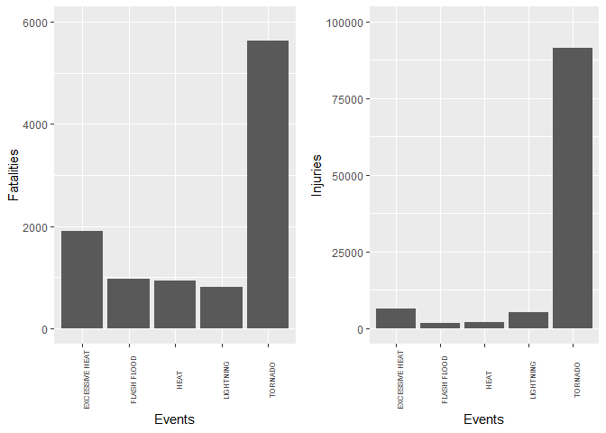
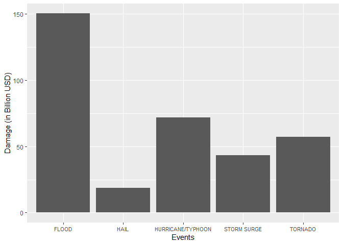

# Synopsis
Storms and other severe weather events cause both public health and economic problems for communities and municipalities. These severe events often result in fatalities, injuries, and property damage. Preventing such outcomes to the extent possible is a key concern.  
The analysis of the data shows that, tornadoes have the greatest impact on public health, as measured by the number of injuries and fatalities.  Excessive heat has the second most impact on public health. Economic impact of weather events was also analyzed. Floods have caused the most damage to economy.

## Loading libraries

```r
library(ggplot2)
library(gridExtra)
```

## Loading and exploring data

```r
data <- read.csv("./data/StormData.csv")
dim(data)
```

```
## [1] 902297     37
```

```r
str(data)
```

```
## 'data.frame':	902297 obs. of  37 variables:
##  $ STATE__   : num  1 1 1 1 1 1 1 1 1 1 ...
##  $ BGN_DATE  : chr  "4/18/1950 0:00:00" "4/18/1950 0:00:00" "2/20/1951 0:00:00" "6/8/1951 0:00:00" ...
##  $ BGN_TIME  : chr  "0130" "0145" "1600" "0900" ...
##  $ TIME_ZONE : chr  "CST" "CST" "CST" "CST" ...
##  $ COUNTY    : num  97 3 57 89 43 77 9 123 125 57 ...
##  $ COUNTYNAME: chr  "MOBILE" "BALDWIN" "FAYETTE" "MADISON" ...
##  $ STATE     : chr  "AL" "AL" "AL" "AL" ...
##  $ EVTYPE    : chr  "TORNADO" "TORNADO" "TORNADO" "TORNADO" ...
##  $ BGN_RANGE : num  0 0 0 0 0 0 0 0 0 0 ...
##  $ BGN_AZI   : chr  "" "" "" "" ...
##  $ BGN_LOCATI: chr  "" "" "" "" ...
##  $ END_DATE  : chr  "" "" "" "" ...
##  $ END_TIME  : chr  "" "" "" "" ...
##  $ COUNTY_END: num  0 0 0 0 0 0 0 0 0 0 ...
##  $ COUNTYENDN: logi  NA NA NA NA NA NA ...
##  $ END_RANGE : num  0 0 0 0 0 0 0 0 0 0 ...
##  $ END_AZI   : chr  "" "" "" "" ...
##  $ END_LOCATI: chr  "" "" "" "" ...
##  $ LENGTH    : num  14 2 0.1 0 0 1.5 1.5 0 3.3 2.3 ...
##  $ WIDTH     : num  100 150 123 100 150 177 33 33 100 100 ...
##  $ F         : int  3 2 2 2 2 2 2 1 3 3 ...
##  $ MAG       : num  0 0 0 0 0 0 0 0 0 0 ...
##  $ FATALITIES: num  0 0 0 0 0 0 0 0 1 0 ...
##  $ INJURIES  : num  15 0 2 2 2 6 1 0 14 0 ...
##  $ PROPDMG   : num  25 2.5 25 2.5 2.5 2.5 2.5 2.5 25 25 ...
##  $ PROPDMGEXP: chr  "K" "K" "K" "K" ...
##  $ CROPDMG   : num  0 0 0 0 0 0 0 0 0 0 ...
##  $ CROPDMGEXP: chr  "" "" "" "" ...
##  $ WFO       : chr  "" "" "" "" ...
##  $ STATEOFFIC: chr  "" "" "" "" ...
##  $ ZONENAMES : chr  "" "" "" "" ...
##  $ LATITUDE  : num  3040 3042 3340 3458 3412 ...
##  $ LONGITUDE : num  8812 8755 8742 8626 8642 ...
##  $ LATITUDE_E: num  3051 0 0 0 0 ...
##  $ LONGITUDE_: num  8806 0 0 0 0 ...
##  $ REMARKS   : chr  "" "" "" "" ...
##  $ REFNUM    : num  1 2 3 4 5 6 7 8 9 10 ...
```
The effect on population health is given by FATALITIES and INJURIES.  
The effect on economic health is calculated by property damage (PROPDMG) and crop damage (CROPDMG). The actual damage in USD is indicated by PROPDMGEXP and CROPDMGEXP parameters. These are the exponents which are to be multiplied to get the actual cost.
<br>

## Subsetting required data

```r
columns <- c("EVTYPE", "FATALITIES", "INJURIES", "PROPDMG", "PROPDMGEXP", "CROPDMG", "CROPDMGEXP")
req_data <- data[ , columns]
```

## Data Preprocessing
Checking for the NA values in subsetted dataset

```r
sum(is.na(req_data$FATALITIES))
```

```
## [1] 0
```

```r
sum(is.na(req_data$INJURIES))
```

```
## [1] 0
```

```r
sum(is.na(req_data$PROPDMG))
```

```
## [1] 0
```

```r
sum(is.na(req_data$PROPDMGEXP))
```

```
## [1] 0
```

```r
sum(is.na(req_data$CROPDMG))
```

```
## [1] 0
```

```r
sum(is.na(req_data$CROPDMGEXP))
```

```
## [1] 0
```
We can see, no NA values are present.  
<br>

Checking the values of PROPDMGEXP and CROPDMGEXP

```r
table(req_data$PROPDMGEXP)
```

```
## 
##             -      ?      +      0      1      2      3      4      5      6 
## 465934      1      8      5    216     25     13      4      4     28      4 
##      7      8      B      h      H      K      m      M 
##      5      1     40      1      6 424665      7  11330
```

```r
table(req_data$CROPDMGEXP)
```

```
## 
##             ?      0      2      B      k      K      m      M 
## 618413      7     19      1      9     21 281832      1   1994
```
As we can see, there are problems with the exponent values. According to this [link](https://rstudio-pubs-static.s3.amazonaws.com/58957_37b6723ee52b455990e149edde45e5b6.html), the index in the PROPDMGEXP and CROPDMGEXP can be interpreted as the following:  
numeric (values between 0 to 8) = x 10  
H, h -> hundreds = x 100  
K, K -> kilos = x 1,000  
M, m -> millions = x 1,000,000  
B,b -> billions = x 1,000,000,000  
(+) -> x 1  
(-) -> x 0  
(?) -> x 0  
blank -> x 0  
<br>
Fixing exponent values in PROPDMGEXP  

```r
req_data$PROPDMGEXP <- sub("0|1|2|3|4|5|6|7|8", "10", req_data$PROPDMGEXP)
req_data$PROPDMGEXP <- sub("h", "100", req_data$PROPDMGEXP, ignore.case = TRUE)
req_data$PROPDMGEXP <- sub("k", "1000", req_data$PROPDMGEXP, ignore.case = TRUE)
req_data$PROPDMGEXP <- sub("m", "1000000", req_data$PROPDMGEXP, ignore.case = TRUE)
req_data$PROPDMGEXP <- sub("b", "1000000000", req_data$PROPDMGEXP, ignore.case = TRUE)
req_data$PROPDMGEXP <- sub("\\+", "1", req_data$PROPDMGEXP)
req_data$PROPDMGEXP <- sub("\\-|\\?", "0", req_data$PROPDMGEXP)
req_data[req_data$PROPDMGEXP == "", "PROPDMGEXP"] <- 0
req_data$PROPDMGEXP <- as.numeric(req_data$PROPDMGEXP)
table(req_data$PROPDMGEXP)
```

```
## 
##      0      1     10    100   1000  1e+06  1e+09 
## 465943      5    300      7 424665  11337     40
```
Creating a variable "property.cost" which is product of PROPDMG and PROPDMGEXP  

```r
req_data$property.cost <- req_data$PROPDMG * req_data$PROPDMGEXP
```

<br>

Fixing exponent values in CROPDMGEXP  

```r
req_data$CROPDMGEXP <- sub("0|2", "10", req_data$CROPDMGEXP)
req_data$CROPDMGEXP <- sub("k", "1000", req_data$CROPDMGEXP, ignore.case = TRUE)
req_data$CROPDMGEXP <- sub("m", "1000000", req_data$CROPDMGEXP, ignore.case = TRUE)
req_data$CROPDMGEXP <- sub("b", "1000000000", req_data$CROPDMGEXP, ignore.case = TRUE)
req_data$CROPDMGEXP <- sub("\\?", "0", req_data$CROPDMGEXP)
req_data[req_data$CROPDMGEXP == "", "CROPDMGEXP"] <- 0
req_data$CROPDMGEXP <- as.numeric(req_data$CROPDMGEXP)
table(req_data$CROPDMGEXP)
```

```
## 
##      0     10   1000  1e+06  1e+09 
## 618420     20 281853   1995      9
```

Creating a variable "crop.cost" which is product of CROPDMG and CROPDMGEXP  

```r
req_data$crop.cost <- req_data$CROPDMG * req_data$CROPDMGEXP
```

<br>

Creating a variable "total_damage" which is sum of "property.cost" and "crop.cost"  

```r
req_data$total_damage <- req_data$property.cost + req_data$crop.cost
head(req_data)
```

```
##    EVTYPE FATALITIES INJURIES PROPDMG PROPDMGEXP CROPDMG CROPDMGEXP
## 1 TORNADO          0       15    25.0       1000       0          0
## 2 TORNADO          0        0     2.5       1000       0          0
## 3 TORNADO          0        2    25.0       1000       0          0
## 4 TORNADO          0        2     2.5       1000       0          0
## 5 TORNADO          0        2     2.5       1000       0          0
## 6 TORNADO          0        6     2.5       1000       0          0
##   property.cost crop.cost total_damage
## 1         25000         0        25000
## 2          2500         0         2500
## 3         25000         0        25000
## 4          2500         0         2500
## 5          2500         0         2500
## 6          2500         0         2500
```
Now that our required data is processed and ready, we can answer the questions.  
<br>

# Across the United States, which types of events are most harmful with respect to population health?

```r
d1 <- aggregate(req_data$FATALITIES, list(req_data$EVTYPE), sum)
d2 <- aggregate(req_data$INJURIES, list(req_data$EVTYPE), sum)
names(d1) <- c("Event", "Fatalities")
names(d2) <- c("Event", "Injuries")
health_dmg <- merge(d1,d2)
rm(d1,d2)
health_dmg <- health_dmg[order(-health_dmg$Fatalities,-health_dmg$Injuries),]
head(health_dmg)
```

```
##              Event Fatalities Injuries
## 834        TORNADO       5633    91346
## 130 EXCESSIVE HEAT       1903     6525
## 153    FLASH FLOOD        978     1777
## 275           HEAT        937     2100
## 464      LIGHTNING        816     5230
## 856      TSTM WIND        504     6957
```
We can see that tornadoes have the most impact on public health in terms of injuries and fatalities. The graph for this is in Results section.
<br>

# Across the United States, which types of events have the greatest economic consequences?

```r
economy_dmg <- aggregate(req_data$total_damage, list(req_data$EVTYPE), sum)
names(economy_dmg) <- c("Events", "Total_damage")
economy_dmg <- economy_dmg[order(-economy_dmg$Total_damage),]
head(economy_dmg)
```

```
##                Events Total_damage
## 170             FLOOD 150319678250
## 411 HURRICANE/TYPHOON  71913712800
## 834           TORNADO  57352117607
## 670       STORM SURGE  43323541000
## 244              HAIL  18758224527
## 153       FLASH FLOOD  17562132111
```
We can see that the event with greatest impact on economy (to property and crops) is floods.The graph for this is in Results section.
<br>

# Results
### Question 1

```r
top_health_dmg <- health_dmg[1:5,]
p <- ggplot(top_health_dmg, aes(x=Event, y=Fatalities)) +
      geom_bar(stat="identity") +
      xlab("Events") +
      ylab("Fatalities") +
      theme(axis.text.x = element_text(angle = 90, size=6)) +
      ylim(0,6000)
q <- ggplot(top_health_dmg, aes(x=Event, y=Injuries)) +
      geom_bar(stat="identity") +
      xlab("Events") +
      ylab("Injuries") +
      theme(axis.text.x = element_text(angle = 90, size=6)) +
      ylim(0,100000)
grid.arrange(p, q, ncol=2)
```

<!-- -->

### Question 2

```r
top_economy_dmg <- economy_dmg[1:5,]
ggplot(top_economy_dmg, aes(x=Events, y=Total_damage/1000000000)) +
      geom_bar(stat = "identity") +
      ylab("Damage (in Billion USD)") +
      theme(axis.text.x = element_text(size=8))
```

<!-- -->

